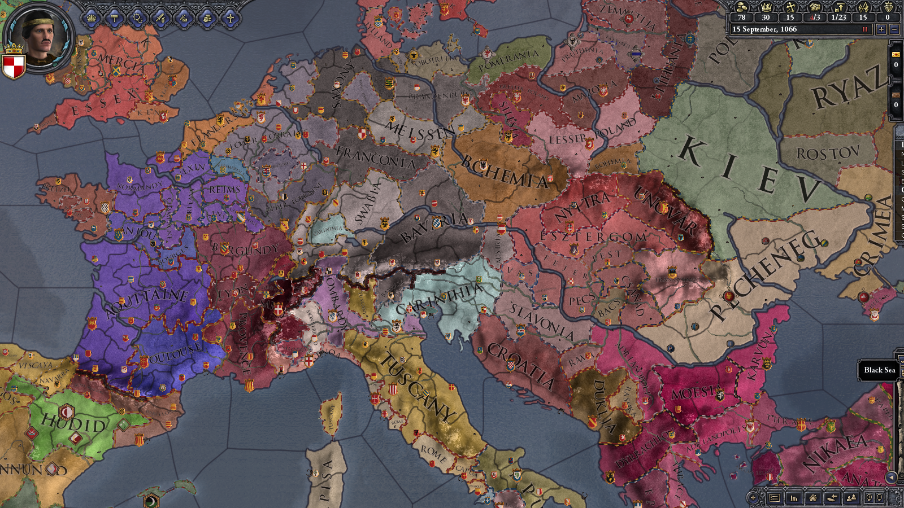

CK2-NoKings-Mod
===============

No Kings Mod for Crusader Kings II.

Delete all titles of Kings and Emperors. So hierarchy top is Duke.

国王と皇帝の称号を全て消して公爵以下だけにする Mod。
独立公爵の時が一番楽しい気がするのに、中央は大国ばかりで独立が辛いので。

国王以上がいないのは開始時のみで、新たに創設することは可能。


Screenshot
----------------------------------------

開始直後のマップ。神聖ローマやビザンツなどの帝国、英仏やハンガリーなどの王国がバラバラになっています。




動作環境
----------------------------------------

* Steam 版 Crusader Kings II Version 2.2
* Windows 8.1


使用方法
----------------------------------------

CK2 の Mod 用フォルダに当プロジェクトのフォルダ・ファイルをコピー後、
CK2 のランチャーを起動して、Mod タブから「NoKings」をチェックして Play。

C:\Users\username\Documents\Paradox Interactive\Crusader Kings II\mod

* NoKings フォルダ
* NoKings.mod ファイル


作成方法メモ
----------------------------------------

CK2 の history/titles 定義ファイルを下記手順で書き換え。本体のバージョンアップ時に再作成が必要かもしれない。

### 元定義ファイルを CK2 本体のインストール先フォルダから mod フォルダへコピー

* From: C:\Program Files (x86)\Steam\SteamApps\common\Crusader Kings II\history\titles
* To: C:\Users\username\Documents\Paradox Interactive\Crusader Kings II\mod\NoKings\history\titles

### 定義ファイルを書き換え
下記は Unix 用のシェルコマンドなので Cygwin (または Unix 系 OS) 上で実行。

```shell-session:
# Mod の titles ディレクトリへ移動
cd "C:/Users/username/Documents/Paradox Interactive/Crusader Kings II/mod/NoKings/history/titles"

# 国王と皇帝の称号定義ファイルを全て削除
rm k_*.txt e_*.txt

# 公爵以下の称号定義ファイル内の liege 定義を全てコメントアウト
find *.txt | xargs sed -r -b -i 's/^(\s*\bliege\s*=\s*"?[ek]_[a-z]+"?)/#\1/g'
```

### ランチャーファイルを設置
場所: C:\Users\username\Documents\Paradox Interactive\Crusader Kings II\mod\NoKings.mod

```text:
name = "NoKings"
path = "mod/NoKings"
user_dir = "NoKings"
replace_path = "history/titles"
```


参考
----------------------------------------
下記の動画を参考にした。

【Crusader Kings2】【番外】全伯爵モード自作Modの作り方  
http://www.nicovideo.jp/watch/sm24096095
